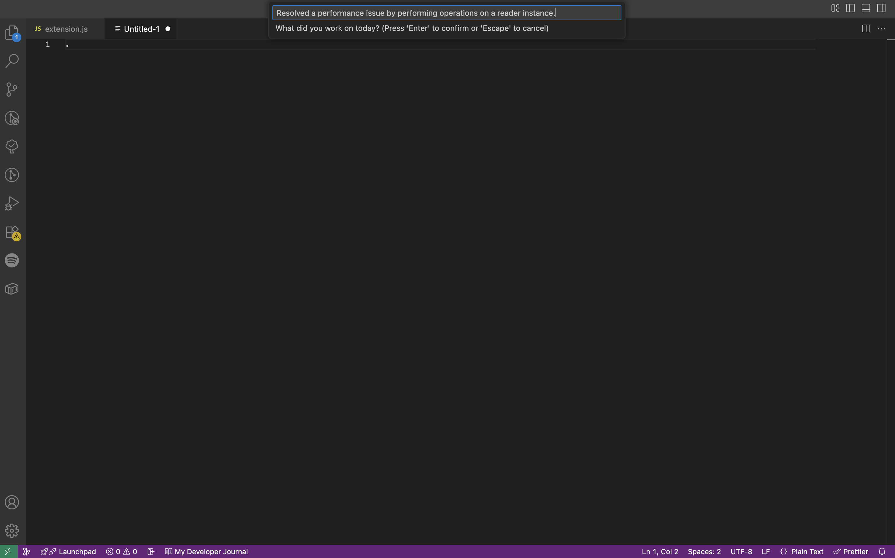
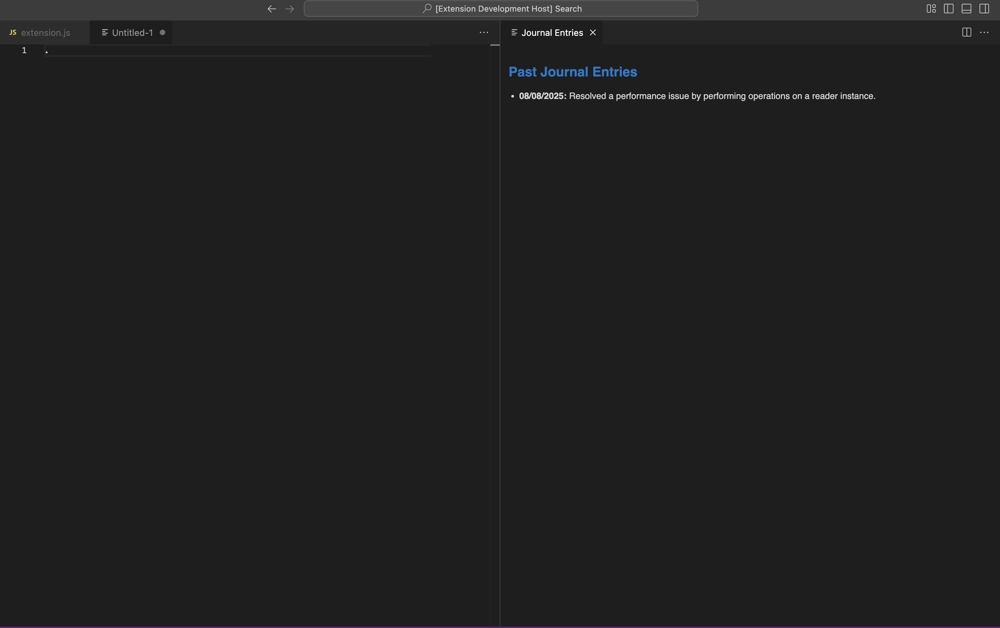

# Jots VSCode Extension ✍️

Stay consistent with your daily dev journaling right from VSCode.

## 🚀 Features

- Create daily journal entries with mood tracking
- View your entry history in a sidebar panel
- Daily reminders at your preferred time

## 📸 Preview

## 🛠️ Commands

Use the Command Palette (⇧⌘P / Ctrl+Shift+P):

- `Jots: Set Token` – Enter your personal API token
- `Jots: New Entry` – Add today's journal log
- `Jots: Show Journal Sidebar` – View your past entries

## ⚙️ Settings

| Setting | Description | Default |
|--------|-------------|---------|
| `journal.reminderHour` | Hour to remind you (0–23) | `17` |
| `journal.reminderMinute` | Minute to remind you | `0` |

## 🔐 Authentication

Get your personal token from your Jots app, then run `Jots: Set Token` in VSCode to connect.

## 📦 Installation

